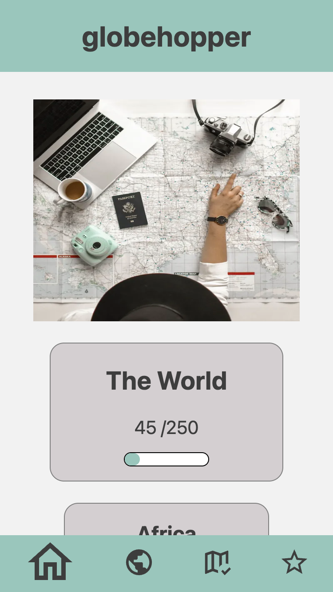

# Globehopper App - Capstone Project at neuefische Bottcamp

Globehopper is an app, where you can track which countries you have already visited and where you want to go next

## Tech Stack

- **React** for building the user interface
- **Next.js** for server rendered React applications
- **Styled Components** for CSS styling
- **useSWR** for fetching an API

## Description

With this travel app, you can easily keep track of the countries you have visited and plan your future travels all in one place

## Getting started

To get started simply visit [Glopehopper App](https://capstone-globehopper.vercel.app/) and try it out! No further installation is required. Just open the link on your preferred web browser and enjoy

## Features

If you are a passionate traveler, this travel app offers some features to make your travel experience easier and more enjoyable. Here are the key features that our app provides

- Visually displayed progress bars on the homepage, showcasing the number of countries you have visited so far
- A comprehensive list of all countries where you can filter by continent or search for a country by name
- The ability to mark countries as "visited" or "want to go" directly from the country list
- Clicking on a country's name will take you to a detailed page that displays useful information such as the country's continent, languages, currencies, and current local time
- The "Explored" page displays all the countries that you have marked as "visited" and sorts them alphabetically
- The "Wish list" page displays all the countries that you have marked as "want to go" and sorts them alphabetically
- The "Plan your trip" button takes you to a form where you can enter the details of your upcoming trip and submit them. You can also edit or delete these details at any time

## Acknowledgements

This project is the final capstome project implemented during the Web Development Bootcamp at neuefische. I would like to thank the entire team of neuefische for their guidance and support throughout the whole process.
